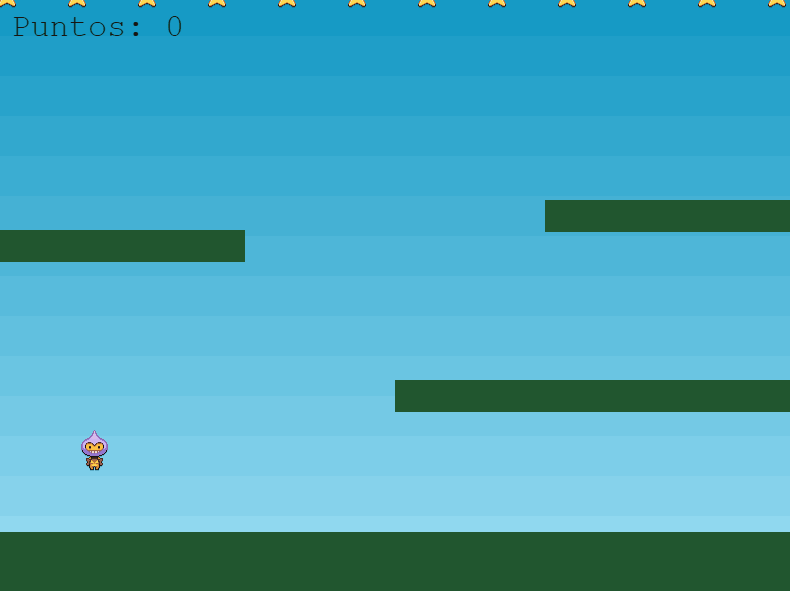

## Juego de plataformas en Phaser 3

Juego desarrollado en el tutorial de Phaser 3 "[Making your first Phaser 3 game](https://phaser.io/tutorials/making-your-first-phaser-3-game/part1)" pero refactorizando el código para usar JS moderno.

